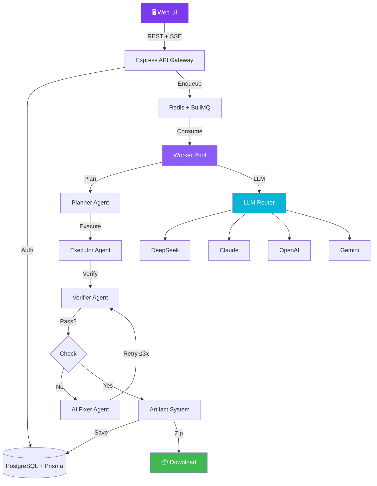

<div align="center">


# AI Dev Platform

### Build Full-Stack Apps with Natural Language

[](https://github.com/Eric30x/ai-dev-system/releases)
[](LICENSE)
[](CONTRIBUTING.md)
[](https://github.com/Eric30x/ai-dev-system/stargazers)

> **Describe your idea. AI plans, writes, verifies, fixes, packages — and ships a complete project in minutes.**

<br>


</div>

---

## ✨ Why AI Dev Platform?

Most AI coding tools are **copilots** — they suggest code one line at a time.

AI Dev Platform is an **autonomous agent swarm**. You describe what you want in natural language, and a pipeline of specialized AI agents — Planner, Executor, Verifier, Fixer — builds the entire project from scratch, verifies it, fixes any issues, packages it as a ZIP, and hands you the download link.

No human in the loop. No incremental prompting. **One prompt → one complete project.**

---

## 🎯 Features

| Category | Feature | Description |
|----------|---------|-------------|
| 🧠 AI Generation | **Multi-Agent Pipeline** | Planner → Executor → Verifier → Fixer → Packager |
| 🧠 AI Generation | **LLM Router** | DeepSeek / Claude / OpenAI / Gemini with auto-fallback |
| 💬 Collaboration | **Project Agent** | Chat with AI to modify files — it actually writes code, not just text |
| 🔧 Self-Healing | **AI Fixer** | LLM diagnoses errors and generates targeted patches (up to 3 rounds) |
| 📦 Version Control | **Artifact System** | Auto-snapshot every build: source, readme, logs, metadata, zip |
| ⏪ Version Control | **Rollback** | One-click restore to any previous version |
| 📡 Real-time | **SSE Streaming** | Live terminal logs pushed from Worker to browser |
| ✏️ Editor | **Monaco Workspace** | VS Code-quality editor with file tree, tabs, syntax highlighting |
| 🔐 Auth | **JWT + API Keys** | Register/login + programmatic API access |
| 💰 Billing | **Stripe Integration** | Free tier (5/day) + Pro plan — gracefully degrades when unconfigured |
| 🗄️ Database | **PostgreSQL + Prisma** | 10 relational tables with migrations |
| ⚡ Queue | **Redis + BullMQ** | Distributed job queue with retry and backoff |

---

## 🏗 Architecture



## 🔄 Agent Workflow

```
User Prompt
    │
    ▼
┌─ Planner ───────────────┐
│  LLM analyzes task       │
│  Generates step-by-step  │
│  JSON plan               │
└──────────┬───────────────┘
           ▼
┌─ Executor ──────────────┐
│  create_file / edit_file │
│  run_command (npm, git)  │
│  Adapts commands for OS  │
└──────────┬───────────────┘
           ▼
┌─ Verifier ──────────────┐
│  npm install + test      │
│  entry file check        │
│  package.json validation │
│  Syntax check            │
└──────────┬───────────────┘
           ▼
      ┌─ Pass? ─┐
      │   Yes   │──────────────┐
      │   No    │              │
      └────┬────┘              │
           ▼                   │
┌─ AI Fixer (max 3 rounds) ─┐  │
│  LLM diagnoses root cause  │  │
│  Generates file patches    │  │
│  Writes corrected code     │  │
│  Return to Verifier ───────┘  │
└───────────────────────────────┘
           ▼
┌─ Artifact System ────────┐
│  Save Source (zip)        │
│  Save Logs                │
│  Save Metadata            │
│  Sync File Tree → DB      │
│  Package Final ZIP        │
└──────────┬────────────────┘
           ▼
      📦 Download Ready
```

---

## 🚀 Quick Start

### Prerequisites

- **Node.js** ≥ 18
- **Docker Desktop** (for PostgreSQL + Redis)

### 1. Clone & Install

```bash
git clone https://github.com/Eric30x/ai-dev-system.git
cd ai-dev-system
npm install
```

### 2. Start Infrastructure

```bash
docker compose up -d postgres redis
```

### 3. Configure Environment

```bash
cp .env.example .env
```

Edit `.env` — at minimum set one AI provider:

```env
# DeepSeek (via Anthropic-compatible API)
ANTHROPIC_BASE_URL=https://api.deepseek.com/anthropic
ANTHROPIC_API_KEY=sk-your-key-here
DEEPSEEK_API_KEY=sk-your-key-here
MODEL_NAME=deepseek-v4-pro
```

Other optional providers: `CLAUDE_API_KEY`, `OPENAI_API_KEY`, `GEMINI_API_KEY`.

### 4. Initialize Database

```bash
npm run db:generate
npm run db:push
```

### 5. Start (two terminals)

```bash
# Terminal 1 — API Server (port 3000)
npm start

# Terminal 2 — Worker Pool
npm run worker
```

Open **http://localhost:3000** — you're ready to build.

---

## 📸 Screenshots

<details open>
<summary><b>Dashboard</b> — Create & monitor projects</summary>
<br>

</details>

<details>
<summary><b>Workspace</b> — Monaco Editor + File Tree + AI Chat + Terminal</summary>
<br>

</details>

<details>
<summary><b>Task In Progress</b> — Real-time SSE logs</summary>
<br>

</details>

<details>
<summary><b>Version History</b> — Artifact system with rollback</summary>
<br>

</details>

<details>
<summary><b>AI Agent</b> — Chat that actually modifies files</summary>
<br>

</details>

---

## 🛠 Tech Stack

| Layer | Technology |
|-------|-----------|
| **Frontend** | TailwindCSS, Monaco Editor, Lucide Icons, SSE |
| **Backend** | Node.js, Express 5, JWT, Stripe |
| **Database** | PostgreSQL, Prisma ORM |
| **Queue** | Redis, BullMQ |
| **AI / LLM** | DeepSeek, Claude, OpenAI, Gemini (auto-fallback) |
| **Infra** | Docker, Docker Compose |
| **Editor** | Monaco Editor (VS Code core) |

---

## 📁 Project Structure

```
├── apps/
│   ├── api/routes/        # REST API endpoints
│   └── web/               # Frontend (SPA)
├── services/
│   ├── auth/              # JWT + API key auth
│   ├── billing/           # Stripe integration
│   ├── queue/             # BullMQ + Redis
│   └── project/           # Workspace, Chat, Agent, Artifact, SSE
├── workers/
│   ├── worker-core/       # Main consumer loop
│   ├── planner/           # Task decomposition (LLM)
│   ├── executor/          # File creation + shell
│   ├── fixer/             # AI-powered fixer (LLM)
│   └── llm-router/        # Multi-provider dispatcher
├── db/
│   ├── schema.prisma      # 10 models
│   └── client.js          # Prisma singleton
├── shared/                # Config, types, utils
├── docker-compose.yml     # Postgres + Redis
└── docs/                  # Documentation
```

---

## 📡 API Reference

### Auth

| Method | Path | Auth | Description |
|--------|------|------|-------------|
| POST | `/api/auth/register` | — | Create account |
| POST | `/api/auth/login` | — | Get JWT token |

### Projects

| Method | Path | Auth | Description |
|--------|------|------|-------------|
| POST | `/api/projects` | JWT | Create + enqueue |
| GET | `/api/projects` | JWT | List projects |
| GET | `/api/projects/:id` | JWT | Project detail |
| GET | `/api/projects/:id/logs` | JWT | Execution logs |
| GET | `/api/projects/:id/download` | JWT | Download final ZIP |

### Workspace (V10)

| Method | Path | Auth | Description |
|--------|------|------|-------------|
| GET | `/api/workspace/:id/files` | — | File tree |
| GET | `/api/workspace/:id/file?path=` | — | Read file |
| PUT | `/api/workspace/:id/files` | — | Write file |
| GET | `/api/workspace/:id/stream` | — | SSE log stream |
| POST | `/api/workspace/:id/chat` | — | AI Chat |
| POST | `/api/workspace/:id/agent` | — | **AI Agent** (modifies files) |

### Artifacts (V10.4)

| Method | Path | Auth | Description |
|--------|------|------|-------------|
| GET | `/api/projects/:id/artifacts` | JWT | Version list |
| GET | `/api/projects/:id/artifact-download?artifactId=` | JWT | Download artifact |
| POST | `/api/projects/:id/rollback` | JWT | Restore version |

---

## 🗺 Roadmap

### V11 — Collaboration & Deploy
- [ ] Team Workspaces (multi-user projects)
- [ ] Git Integration (auto-commit, branch, PR)
- [ ] One-Click Deploy (Vercel, Railway, Docker)
- [ ] Agent Memory (project-level context persistence)

### V12 — Enterprise
- [ ] SSO / OAuth (GitHub, Google)
- [ ] Usage Analytics Dashboard
- [ ] Custom Agent Templates
- [ ] Webhook Notifications

---

## 🤝 Contributing

Contributions are welcome! See [CONTRIBUTING.md](CONTRIBUTING.md).

1. Fork the repo
2. Create a feature branch: `git checkout -b feat/amazing-feature`
3. Commit your changes: `git commit -m 'feat: add amazing feature'`
4. Push: `git push origin feat/amazing-feature`
5. Open a Pull Request

---

## 📄 License

MIT © [Eric30x](https://github.com/Eric30x)

---

<div align="center">

**⭐ If this project helps you, give it a star!**

[](https://star-history.com/#Eric30x/ai-dev-system&Date)

</div>
