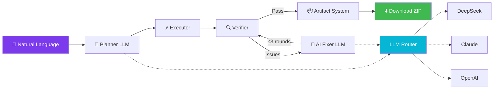

<div align="center">


# AI Dev Platform

### Describe your idea. AI ships the entire project.

[](https://github.com/Eric30x/ai-dev-system/releases)
[](LICENSE)
[](CONTRIBUTING.md)
[](https://github.com/Eric30x/ai-dev-system/stargazers)

> **One prompt → Planner → Executor → Verifier → AI Fixer → ZIP download.**
>
> *No copilot. No incremental prompting. Autonomous agent swarm.*

<br>


</div>

---

## What is this?

Most AI coding tools are **copilots**. They suggest code one line at a time. You still do the heavy lifting.

**AI Dev Platform is different.** You describe what you want in plain English. A pipeline of specialized AI agents plans the architecture, writes every file, installs dependencies, verifies the output, auto-fixes any issues, packages it — and hands you a download link.

**No human in the loop. One prompt → one complete, runnable project.**

---

## Quick Demo

```bash
# 1. Start the platform
npm start              # Terminal 1
npm run worker          # Terminal 2

# 2. Open http://localhost:3000

# 3. Type: "Create a REST API with Express, JWT auth, and PostgreSQL"

# 4. Watch: Planning → Writing files → npm install → Verifying → ZIP ready

# 5. Click Download. You have a complete project.
```

---

## Architecture



## Features

| | |
|---|---|
| 🧠 **Multi-Agent Pipeline** | Planner → Executor → Verifier → AI Fixer → Packager |
| 🤖 **AI Fixer** | LLM diagnoses errors, generates patches, retries up to 3 rounds |
| 💬 **Project Agent** | Chat with AI that actually writes code, not just text |
| ✏️ **Monaco Editor** | VS Code-quality workspace with file tree + tabs + syntax highlighting |
| 📦 **Artifact System** | Every build auto-snapshotted: source zip, logs, metadata |
| ⏪ **Rollback** | One-click restore to any previous version |
| 📡 **Real-time SSE** | Live terminal logs pushed from Worker to browser |
| 🔀 **LLM Router** | DeepSeek / Claude / OpenAI / Gemini with auto-fallback |
| 🗄️ **PostgreSQL + Prisma** | 10 relational tables, type-safe queries |
| ⚡ **Redis + BullMQ** | Distributed job queue with retry, backoff, dead letter |
| 🔐 **JWT + API Keys** | Register/login + programmatic access |
| 💰 **Stripe Billing** | Free tier (5/day) → Pro — gracefully degrades when unconfigured |

## Quick Start

```bash
git clone https://github.com/Eric30x/ai-dev-system.git && cd ai-dev-system
npm install
docker compose up -d postgres redis
cp .env.example .env   # Add your LLM API key
npm run db:generate && npm run db:push
npm start              # Terminal 1
npm run worker          # Terminal 2
```

Open **http://localhost:3000**

## Tech Stack

| Layer | Technology |
|-------|-----------|
| Frontend | TailwindCSS, Monaco Editor (VS Code core), Lucide Icons, SSE |
| Backend | Node.js, Express 5, JWT, Stripe |
| Database | PostgreSQL, Prisma ORM |
| Queue | Redis, BullMQ |
| AI | DeepSeek, Claude, OpenAI, Gemini |
| Infra | Docker, Docker Compose |
| Editor | Monaco Editor (`monaco.editor.create`) |

## 📁 Project Structure

```
apps/api/routes/     # REST endpoints
apps/web/            # SPA frontend
services/            # Auth, Billing, Workspace, Agent, Chat, Artifact, SSE, Queue
workers/             # Planner, Executor, Verifier, AI Fixer, LLM Router
db/                  # Prisma schema (10 models) + client
shared/              # Config, types, utils
docs/                # Full documentation
```

## Projects Built with AI Dev Platform

> *Actual output from the platform — each created with a single prompt:*

| Prompt | Generated |
|--------|-----------|
| *"Express server with GET /health"* | `server.js` + `package.json` + `npm install` ✅ |
| *"Markdown blog engine"* | Express + EJS templates + file-based posts ✅ |
| *"SaaS dashboard with Next.js"* | React components + Tailwind + Prisma schema ✅ |

---

## Documentation

| Document | |
|----------|-----|
| [Architecture](docs/architecture.md) | System design, data flow, scaling strategy |
| [Agent Workflow](docs/agent-workflow.md) | Planner → Executor → Verifier → Fixer pipeline |
| [Artifact System](docs/artifact-system.md) | Versioning, rollback, storage |
| [API Reference](docs/api.md) | All endpoints with request/response examples |
| [Database](docs/database.md) | Schema ERD, models, enums, migrations |
| [Deployment](docs/deployment.md) | VPS, Docker, Railway, Render |

---

## Roadmap

### V11 — `git checkout -b feat/v11`
- [ ] Team Workspaces
- [ ] Git Integration (auto commit → branch → PR)
- [ ] One-Click Deploy (Vercel / Railway)
- [ ] Agent Memory (context persistence)

### V12
- [ ] OAuth (GitHub, Google)
- [ ] Usage Analytics
- [ ] Custom Agent Templates
- [ ] Webhook notifications

---

## Contributing

```bash
git checkout -b feat/my-feature
# make changes
git commit -m "feat: description"
git push origin feat/my-feature
# open PR
```

See [CONTRIBUTING.md](CONTRIBUTING.md) and [CODE_OF_CONDUCT.md](CODE_OF_CONDUCT.md).

---

## License

MIT © [Eric30x](https://github.com/Eric30x)

---

<div align="center">

**⭐ Star this repo if it inspires you**

[](https://star-history.com/#Eric30x/ai-dev-system&Date)

</div>
